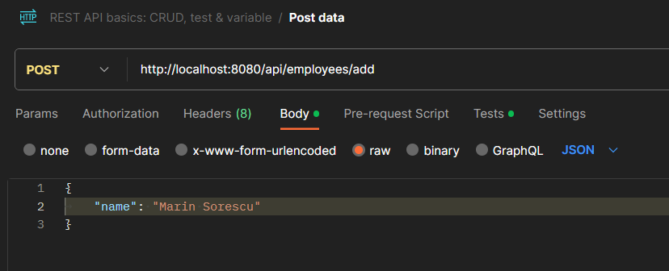
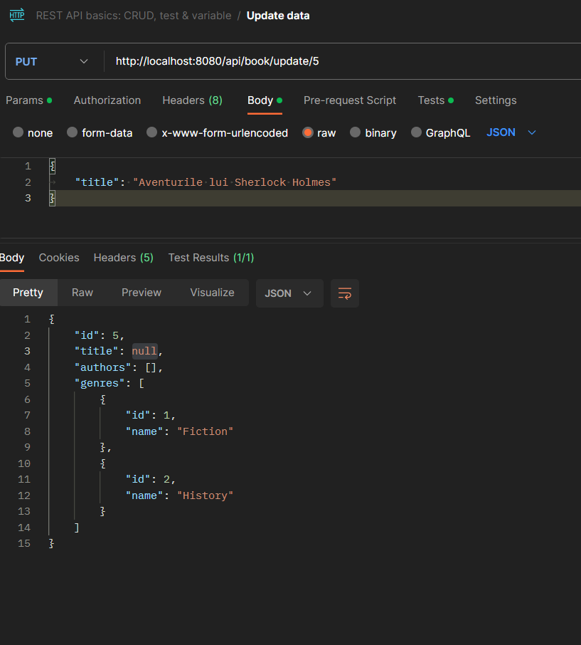
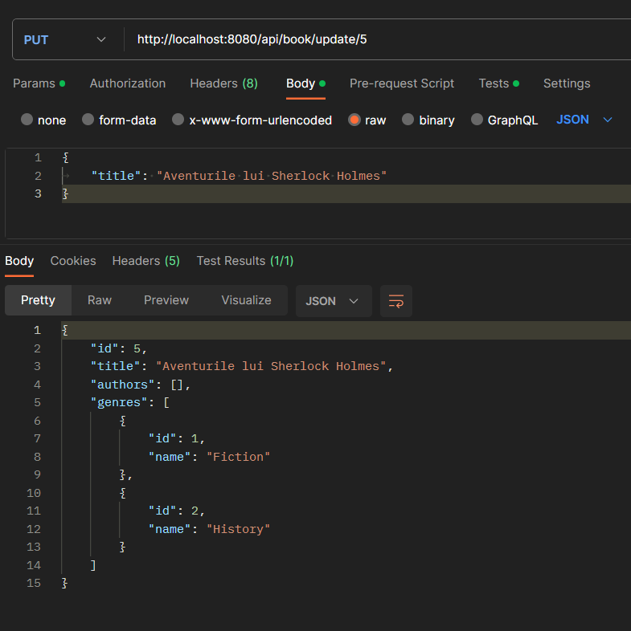
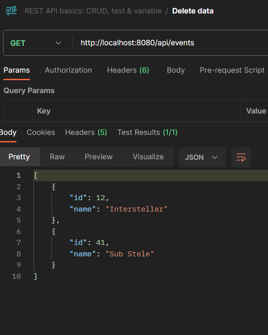
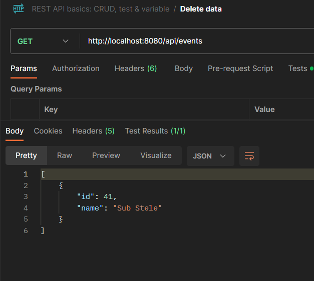

# Library Spring Project

## Introduction

Welcome to the Library Spring Project! This comprehensive Spring Boot application is designed to efficiently manage and organize a library's operations through a robust RESTful service. Leveraging CRUD (Create, Read, Update, Delete) functionality, the project encompasses ten essential entities, each playing a crucial role in the seamless functioning of a modern library.

## Key Entities:

### 1. Library
The central entity representing the library itself, containing essential information about its
name, and id, making this project useful for bigger usages.

#### Attributes:
- `id` (INT): Unique identifier for the library.
- `name` (String): Name of the library.

### 2. Librarian
Dedicated to managing the librarian, this entity includes information about the individuals responsible for the day-to-day operations within the library.

#### Attributes:
- `idLibrarian` (INT): Unique identifier for the librarian.
- `name` (String): Name of the librarian.
- `idLibrary` (INT): Creates a unique connection between librarian and library.

### 3. Events
Tracking various events taking place in the library, this entity captures details such as event name and an unique identifier.

#### Attributes:
- `id` (INT): Unique identifier for the event.
- `name` (String): Name or title of the event.

### 4. Genre
Categorizing books, the Genre entity helps in organizing the library's collection and simplifying the search process for library users.

#### Attributes:
- `id` (INT): Unique identifier for the genre.
- `name` (String): Name of the genre.

### 5. Author
Highlighting the literary creators, the Author entity contains details about the writers whose works are available in the library.

#### Attributes:
- `id` (INT): Unique identifier for the author.
- `name` (String): Name of the author.

### 6. Book
A fundamental entity, Book encapsulates information about the library's 
collection, including title, author, and genre.

#### Attributes:
- `id` (INT): Unique identifier for the book.
- `name` (String): Title of the book.

### 7. Employee
Managing the library staff, the Employee entity holds details about individuals working in various roles within the library.

#### Attributes:
- `id` (INT): Unique identifier for the employee.
- `name` (String): Name of the employee.
- `idLibrary` (INT): Necessary to be able to identify the library they work at.

### 8. PC
For libraries providing computer facilities, the PC entity tracks information about individual computers, such as availability and configuration.

#### Attributes:
- `idPC` (INT): Unique identifier for the PC.
- `name` (String): Name or identifier for the PC.
- `idPCRoom` (INT): To be able to identify the room in which the PC is located.

### 9. PCRoom
Expanding on the PC entity, PCRoom manages spaces dedicated to computer facilities within the library.

#### Attributes:
- `id` (INT): Unique identifier for the PCRoom.
- `name` (String): Name of the PCRoom.

### 10. Customer
Focusing on library users, the Customer entity contains information about individuals who visit the library to borrow books or utilize its resources.

#### Attributes:
- `id` (INT): Unique identifier for the customer.
- `name` (String): Name of the customer.

## Project Features:
- **RESTful Service**: The project implements a RESTful service, offering a standardized approach for communication and interaction with the library's data.
- **CRUD Operations**: Utilizing Create, Read, Update, and Delete operations, the application ensures seamless management of library resources and entities.
- **Efficient Library Operations**: From book borrowing to librarian management, the project aims to streamline various aspects of library operations.

Whether you are a librarian managing the library's resources or a library user looking for information, the Library Spring Project provides a comprehensive and user-friendly solution to meet your needs. Dive into the world of organized and efficient library management with our Spring Boot application!

## JPA Integration:
The project seamlessly integrates with JPA for data persistence, allowing for efficient storage and retrieval of information related to library entities. JPA annotations are used to map Java objects to database tables, providing a clean and object-oriented approach to managing the project's data.

## RESTful API

The project provides a RESTful API for managing entities. It follows the common CRUD operations (Create, Read, Update, Delete) and is structured based on the BaseController class.

# Examples of CRUD Operations with Postman

## 1. Create (POST) - Add a New Employee (example)
**Request:**
- **Method:** POST
- **Endpoint:** `/api/employees/add`
- **Body:**
- 
  
- 
## 2. Read (GET) - Retrieve Information about Authors (example)
**Request:**
- **Method:** GET
- **Endpoint:** `/api/authors/getAll`
- **Body:**

## 3. Update (PUT) - Modify Book Information (example)
**Request:**
- **Method:** PUT
- **Endpoint:** `/api/book/update/{{bookid}}`
- **Body:**
- **Before sending the Update Message:**

- **After sending the Update Message:**

## 4. Delete (DELETE) - Remove an Event (example)
**Request:**
- **Method:** DELETE
- **Endpoint:** `/api/events/{{eventId}}`
- **Body:**
- **Before sending a Delete Message, there are 2 events:**

- **After sending a Delete Message, there is only one Event left:**

  
# Use Cases for Library Spring Project with JPA

## 1. Library Resource Management
**Use Case:** Librarians and administrators can efficiently manage and organize the library's vast collection of books, genres, and authors using the CRUD operations provided by the RESTful service.
**Example Scenario:** A librarian adds a new book to the library, specifying the title, author and genre. The information is seamlessly stored in the database using JPA.

## 2. Management of Multiple Libraries
**Use Case:** Bigger companies, with multiple library stores, can use the system to store and keep track of books from each library, events that take place and employees in each library.
**Example Scenario:** The company or publishing house can own multiple libraries in the same city. This project helps keep track of the activity of each book store individually but it can control and access the overall information from each of them.

## 3. Event Management
**Use Case:** The library can organize and manage various events such as book launches, author talks, and workshops using the Events entity.
**Example Scenario:** The library plans a literary event, adds details like the event title. The information is stored, allowing users to access event details and participate.

## 4. Employee and PC Management
**Use Case:** Library administrators can keep track of employees, manage computer resources, and monitor the functionality of PCs in the library.
**Example Scenario:** An administrator adds a new employee to the system, including details like name and role(librarian). Additionally, the librarian can ensure accurate information for library users.

## 5. Genre-Based Recommendations
**Use Case:** The system can provide personalized book recommendations based on a user's preferred genres and reading history.
**Example Scenario:** A customer can access books from his prefered genre, by searching for the books that have that GenreId. 

